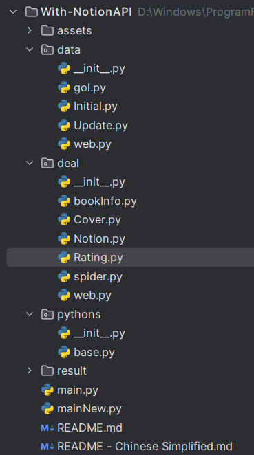
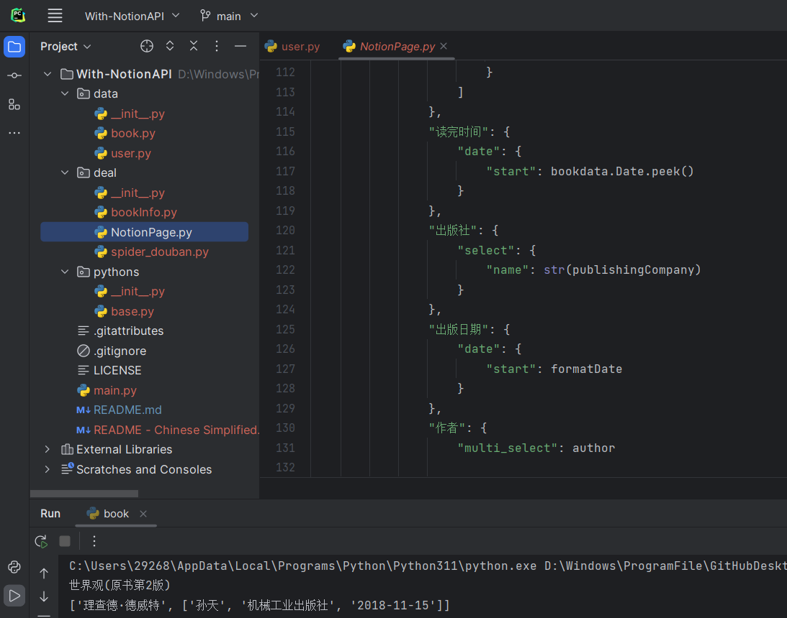
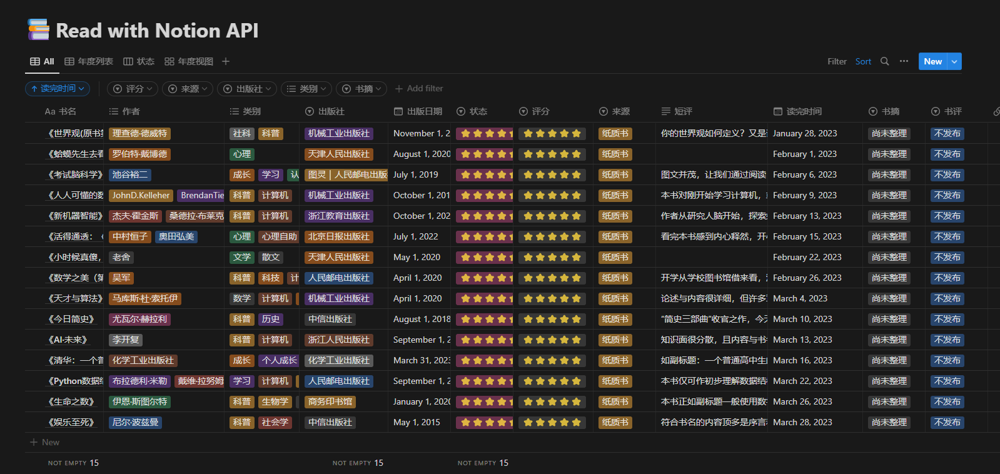

# With-NotionAPI
> Saving data of the books and videos into the notion page with Python.

>使用Python将图书和影视数据存放入Notion中。

# 🗣️Language  

[English](./README.md)

[中文简体](./README%20-%20Chinese%20Simplified.md)

# 🖼️Environment

- Python 3.9+ ( < 3.12)
- PyCharm 2021+

# 🎈Attention

The programming project is in the test phase, I am not sure that it can get running on your machine. Furthermore, I am also trying to build function for better. If you have discovered some problems, tell me. I am very will to solve it. Think you!

[Click here to view progress](https://www.notion.so/yapotato/Notion-API-93ad50c4bcc34c608fdc1fe211d6b322?pvs=4)

---

# 🎢 Schedule

## Web ([Douban](https://www.douban.com/))

- [x] Cover Link (Save the file of the Excel)
- [x] Page Turning
- [ ] Specify the number of  data

## Update into Notion

- [ ] Last Run
- [ ] Iron
- [ ] Cover
- [x] Start

# 🤖Action

## 1. Ready

Have two accounts, they are "[Douban](https://www.douban.com/)" and [Notion](https://www.notion.so/).

## 2. About Code Files (Waiting Final Completed)

**The Follow Content is From an Old Version❗**

<u>Accoding to the user.py can know it save data and function.</u>

<u>book.py for other python files to quote data.</u>

<u>bookInfo.py during testing (Addition export cover link into file is csv on April 9,2023).</u>

<u>spider.py is main function of  spider website.</u>

<u>At present saving data and running main file in main.py.</u>

<u>In pythons packages under file is both Stack and Queue.</u> 

## 3. Modify Necessarily Data

A begin with, modify some necessarily data that are website and Notion API. For webiste, it is "[Douban](https://www.douban.com/)"(A platform of remark books and films) both  URL and Cookie. For [Notion API](https://developers.notion.com/), it is both token and id of database or pages.

In addition, modify other default information about book, which are star, status, bookCategory, bookRemark and bookExcerpt. 

## 4. Running

You must go throught  [Second Step](#2. Modify Necessarily Data)  can complete running main.py.

# 🎗️For Example

[With Notion API——Contain data of the books and videos in Douban website and that update into Notion database_bilibili](https://www.bilibili.com/video/BV15o4y1W7hw/?spm_id_from=333.999.0.0)

# 🔗Other Link

[Create Notion API](https://www.notion.so/my-integrations)
