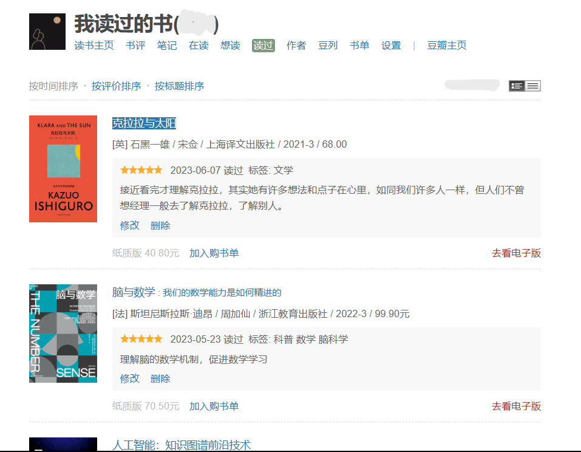

> Saving data of the books and videos into the notion page with Python.

>使用Python将图书和影视数据存放入Notion中。


# 🖼️介绍

## 环境

- Python 3.10+ （建议 3.11 及以上）
- Pycharm / Vs Code / Vs Code Studio

## 项目结构

```
│  .env - 虚拟环境
│  main.py - 主函数、执行程序
│  README.md
│  requirements.txt - 依赖库
│
├─assets - README.md文件
│
├─function - 其它功能函数
│  │  glo.py - 全局数据
│  │  initial.py - 初始化
│  │  logging.py - 日志输出
│  │  spider.py - 爬取个人豆瓣数据
│  │  __init__.py
│  │
│
├─icon - 图标
│      book.svg
│      movie.svg
│      video.svg
│
├─json - 类别数据
│      book.json - 书籍数据
│      video.json - 影视数据
│
├─last mark - 上次标记
│      new_book.txt - 上次书籍标记
│      new_video.txt - 上次影视标记
│
└─log - 日志文件
```

---

# 🐾 步骤

1. [Notion API创建](https://www.notion.so/Notion-93ad50c4bcc34c608fdc1fe211d6b322?pvs=21)
2. [数据爬取](https://www.notion.so/Notion-93ad50c4bcc34c608fdc1fe211d6b322?pvs=21)
3. 更新入Notion

## 🕷️ 网页数据

- 头文件
  - URL
  - Cookie
  - User-Agent
- 图书
  - 书名
  - 图像
  - 作者
  - 出版日期
  - 出版社
  - 标记数据
  - 短评
- 影视
  - 影片名
  - 图像
  - 上映日期
  - 标记数据


## 🤖 Notion

- [获得Token码](https://www.notion.so/Notion-18d07bcc24d54bddb97110814b23ddb6?pvs=21)
- 获得数据库页面ID并链接
- 存入数据


# 🎢 特征

## [豆瓣网](https://www.douban.com/)数据

- [x] 数据图像
- [x] 翻页数据提取
- [x] 增量更新

## 存入 Notion

- [x] 图标
- [x] 图像
- [x] 评星


# 🤖行动

## 1. 准备阶段

拥有[豆瓣](https://www.douban.com/)和[Notion](https://www.notion.so/)账户。



## 2. 修改必要数据

下载好源码后解压进入目录，执行以下步骤：（[点击下载](https://github.com/amlei/Use-NotionAPI/archive/refs/heads/main.zip)）

1. 安装依赖

```powershell
pip install -r rerequirements.txt
```


2. 打开 `new_book.txt` 与 `new_video.txt` 更改你的 Notion 页面中最新的标记数据

3. 打开 `.env` 文件，修改必要参数


4. 运行 `main.py` 文件


# 🔗其它链接

[Notion API的使用——获取豆瓣书影数据更新入Notion数据库_哔哩哔哩](https://www.bilibili.com/video/BV15o4y1W7hw/?spm_id_from=333.999.0.0)

[创建 Notion API](https://www.notion.so/my-integrations)

[Notion API使用思路](https://www.notion.so/yapotato/Notion-API-ChatGPT-93ad50c4bcc34c608fdc1fe211d6b322?pvs=4)
